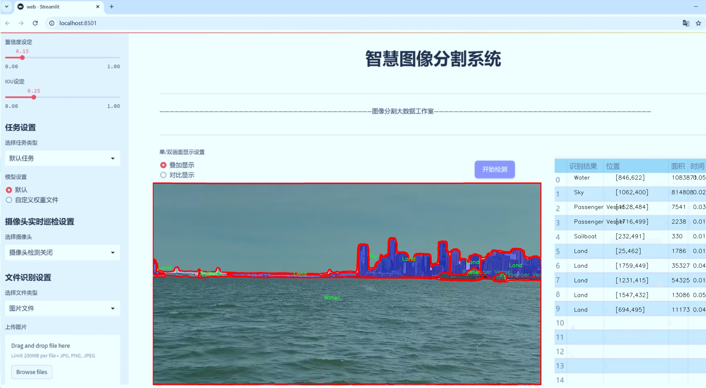
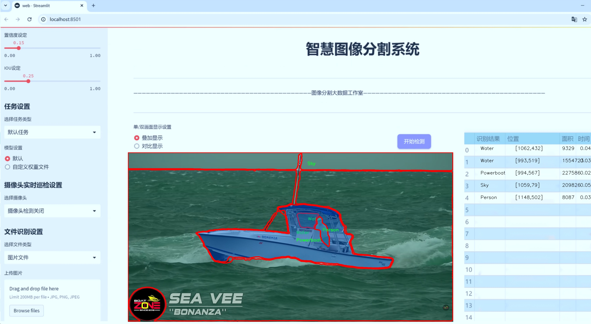
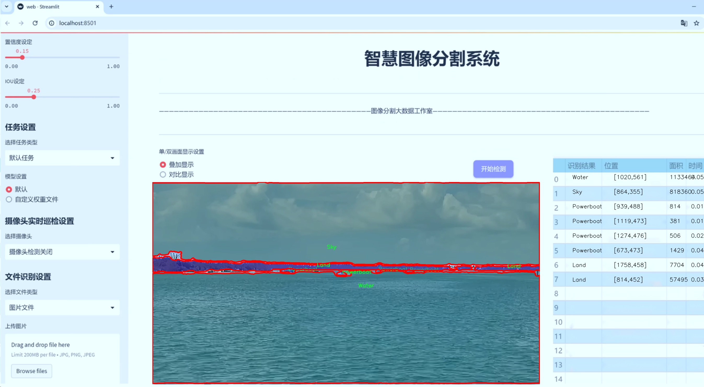
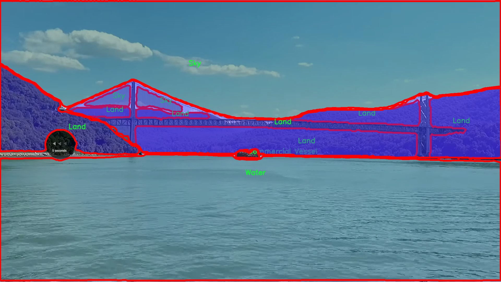
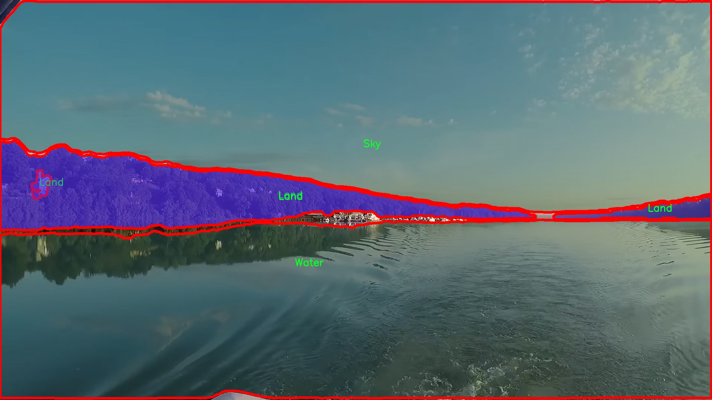
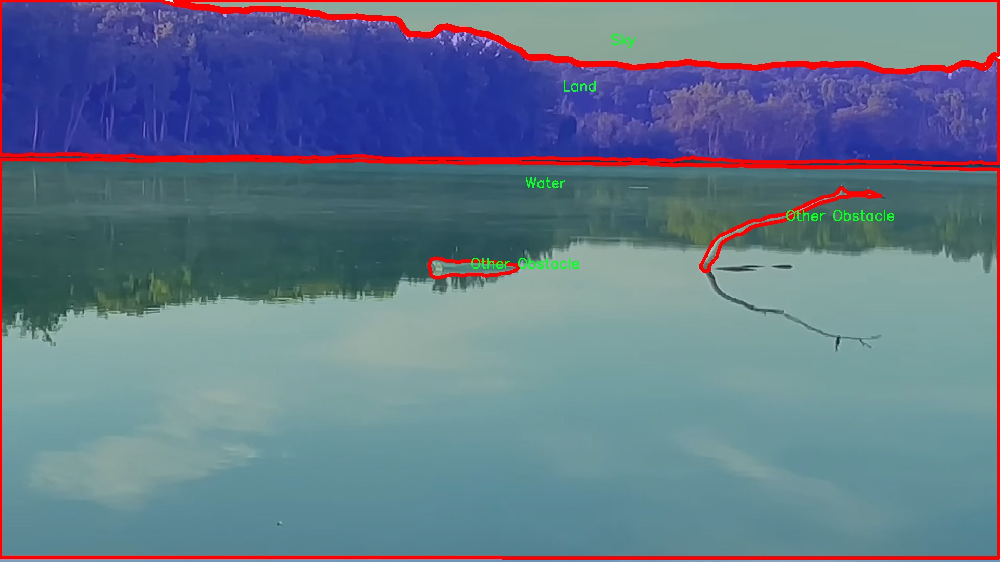
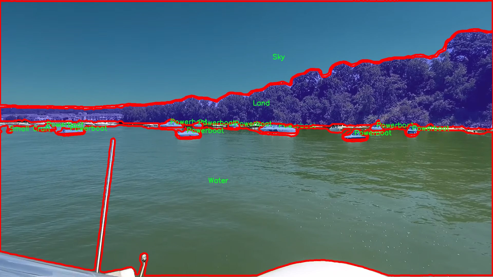
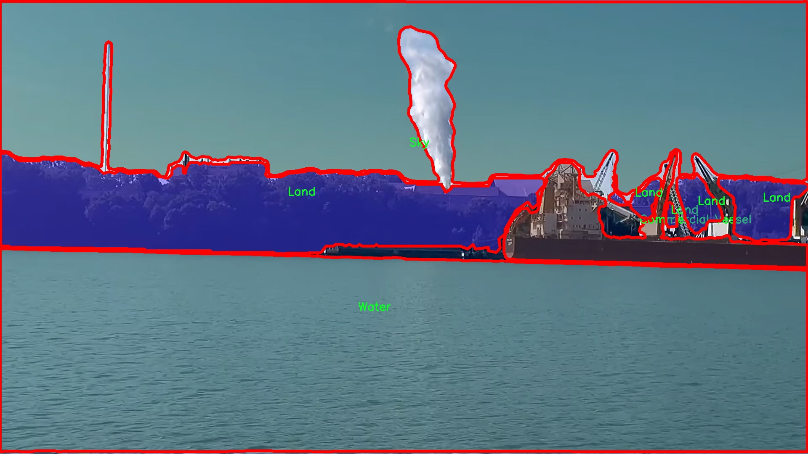

# 水面场景物体图像分割系统： yolov8-seg-C2f-EMSC

### 1.研究背景与意义

[参考博客](https://gitee.com/YOLOv8_YOLOv11_Segmentation_Studio/projects)

[博客来源](https://kdocs.cn/l/cszuIiCKVNis)

研究背景与意义

随着水面场景物体识别和分割技术的不断发展，基于深度学习的图像处理方法在海洋监测、环境保护、航运安全等领域中得到了广泛应用。水面场景的复杂性和多样性使得物体识别和分割任务面临诸多挑战，例如光照变化、波浪干扰以及水面反射等因素都可能影响到图像的质量和物体的可识别性。因此，开发一种高效、准确的水面场景物体图像分割系统显得尤为重要。

本研究旨在基于改进的YOLOv8模型，构建一个针对水面场景的物体图像分割系统。YOLO（You Only Look Once）系列模型因其实时性和高效性而受到广泛关注，尤其是在物体检测和分割任务中表现出色。通过对YOLOv8模型的改进，我们希望能够提高其在水面场景中对多种物体的分割精度，进而提升系统在实际应用中的有效性。

本研究所使用的数据集“combined-demo-segs”包含1600幅图像，涵盖了13个类别的物体，包括浮标、商船、死鲸、渔船、乘客船、动力艇、帆船等。这些类别的多样性为模型的训练提供了丰富的样本，有助于提高模型对不同物体的识别能力。同时，数据集中还包含了水面、天空和其他障碍物等背景信息，这将为模型的学习提供更为全面的上下文信息，从而增强其在复杂场景中的表现。

在水面场景中，物体的形态、颜色和运动状态各异，传统的图像处理方法往往难以应对这种复杂性。通过引入深度学习技术，尤其是基于YOLOv8的改进模型，我们可以利用其强大的特征提取能力和实时处理能力，显著提升物体分割的准确性和效率。此外，改进后的模型还将通过数据增强、迁移学习等技术，进一步提升其在特定场景下的泛化能力，使其能够适应不同的水面环境。

本研究的意义不仅在于提升水面场景物体图像分割的技术水平，更在于为海洋监测、生态保护和航运安全等实际应用提供有效的技术支持。通过准确识别和分割水面上的各类物体，相关部门可以更好地进行环境监测、船舶管理和事故预警，从而为保护海洋生态环境和提高航运安全提供科学依据。

综上所述，基于改进YOLOv8的水面场景物体图像分割系统的研究，不仅具有重要的学术价值，还有助于推动相关领域的技术进步和应用发展。通过本研究，我们期望能够为水面场景的智能化处理提供新的思路和方法，促进深度学习技术在实际应用中的落地与发展。

### 2.图片演示







注意：本项目提供完整的训练源码数据集和训练教程,由于此博客编辑较早,暂不提供权重文件（best.pt）,需要按照6.训练教程进行训练后实现上图效果。

### 3.视频演示

[3.1 视频演示](https://www.bilibili.com/video/BV1Q8ByY1ETP/)

### 4.数据集信息

##### 4.1 数据集类别数＆类别名

nc: 13
names: ['Buoy-Marker', 'Commercial Vessel', 'Fishing Boat', 'Land', 'Other Obstacle', 'POV Vessel', 'Passenger Vessel', 'Person', 'Powerboat', 'Sailboat', 'Sky', 'Small Craft', 'Water']


##### 4.2 数据集信息简介

数据集信息展示

在现代计算机视觉领域，图像分割技术的应用日益广泛，尤其是在水面场景的物体识别与分割中，具有重要的实际意义。本研究旨在通过改进YOLOv8-seg模型，提升水面场景物体的图像分割精度与效率。为此，我们采用了名为“combined-demo-segs”的数据集，该数据集专门针对水面环境中的多种物体进行标注，涵盖了丰富的类别信息，极大地支持了我们的研究目标。

“combined-demo-segs”数据集包含13个不同的类别，具体包括：Buoy-Marker（浮标标记）、Commercial Vessel（商业船舶）、Fishing Boat（渔船）、Land（陆地）、Other Obstacle（其他障碍物）、POV Vessel（视角船舶）、Passenger Vessel（客船）、Person（人）、Powerboat（动力艇）、Sailboat（帆船）、Sky（天空）、Small Craft（小型船舶）以及Water（水面）。这些类别的设置不仅考虑到了水面场景的多样性，还反映了实际应用中可能遇到的各种物体类型，确保了数据集的全面性和代表性。

在数据集的构建过程中，所有类别的图像均经过精细的标注，以确保每个物体的边界清晰可辨。这种高质量的标注对于训练深度学习模型至关重要，因为模型的性能往往依赖于训练数据的质量和多样性。通过使用“combined-demo-segs”数据集，我们能够为YOLOv8-seg模型提供丰富的训练样本，使其在面对复杂的水面场景时，能够更准确地识别和分割不同的物体。

在水面场景中，物体的外观和背景往往会受到光照、波浪、天气等因素的影响，因此，数据集中的图像涵盖了多种不同的环境条件。这种多样性不仅增强了模型的鲁棒性，还使其能够适应不同的实际应用场景。例如，在晴天和阴天、平静水面和波涛汹涌的水面上，模型都能够保持较高的分割精度。此外，数据集中包含的人物、船舶等类别的多样性，使得模型在处理复杂场景时，能够更好地进行物体分离与识别。

通过对“combined-demo-segs”数据集的深入分析，我们发现该数据集在训练过程中表现出了良好的泛化能力。模型在不同类别之间的分割效果均衡，能够有效地区分相似物体，如不同类型的船舶和水面障碍物。这一特性使得我们的改进YOLOv8-seg模型在实际应用中，能够提供更为精准的物体识别与分割结果，满足水面监测、海洋安全等领域的需求。

综上所述，“combined-demo-segs”数据集为改进YOLOv8-seg的水面场景物体图像分割系统提供了坚实的基础。其丰富的类别信息和高质量的标注数据，确保了模型在训练过程中的有效性和准确性。未来，我们将继续探索数据集的潜力，结合更先进的算法与技术，推动水面物体图像分割的研究与应用。











### 5.项目依赖环境部署教程（零基础手把手教学）

[5.1 环境部署教程链接（零基础手把手教学）](https://www.bilibili.com/video/BV1jG4Ve4E9t/?vd_source=bc9aec86d164b67a7004b996143742dc)


[5.2 安装Python虚拟环境创建和依赖库安装视频教程链接（零基础手把手教学）](https://www.bilibili.com/video/BV1nA4VeYEze/?vd_source=bc9aec86d164b67a7004b996143742dc)

### 6.手把手YOLOV8-seg训练视频教程（零基础手把手教学）

[6.1 手把手YOLOV8-seg训练视频教程（零基础小白有手就能学会）](https://www.bilibili.com/video/BV1cA4VeYETe/?vd_source=bc9aec86d164b67a7004b996143742dc)


按照上面的训练视频教程链接加载项目提供的数据集，运行train.py即可开始训练



     Epoch   gpu_mem       box       obj       cls    labels  img_size
     1/200     0G   0.01576   0.01955  0.007536        22      1280: 100%|██████████| 849/849 [14:42<00:00,  1.04s/it]
               Class     Images     Labels          P          R     mAP@.5 mAP@.5:.95: 100%|██████████| 213/213 [01:14<00:00,  2.87it/s]
                 all       3395      17314      0.994      0.957      0.0957      0.0843

     Epoch   gpu_mem       box       obj       cls    labels  img_size
     2/200     0G   0.01578   0.01923  0.007006        22      1280: 100%|██████████| 849/849 [14:44<00:00,  1.04s/it]
               Class     Images     Labels          P          R     mAP@.5 mAP@.5:.95: 100%|██████████| 213/213 [01:12<00:00,  2.95it/s]
                 all       3395      17314      0.996      0.956      0.0957      0.0845

     Epoch   gpu_mem       box       obj       cls    labels  img_size
     3/200     0G   0.01561    0.0191  0.006895        27      1280: 100%|██████████| 849/849 [10:56<00:00,  1.29it/s]
               Class     Images     Labels          P          R     mAP@.5 mAP@.5:.95: 100%|███████   | 187/213 [00:52<00:00,  4.04it/s]
                 all       3395      17314      0.996      0.957      0.0957      0.0845


### 7.50+种全套YOLOV8-seg创新点加载调参实验视频教程（一键加载写好的改进模型的配置文件）

[7.1 50+种全套YOLOV8-seg创新点加载调参实验视频教程（一键加载写好的改进模型的配置文件）](https://www.bilibili.com/video/BV1Hw4VePEXv/?vd_source=bc9aec86d164b67a7004b996143742dc)

### YOLOV8-seg算法简介

原始YOLOv8-seg算法原理

YOLOv8-seg算法作为YOLO系列中的最新版本，继承并发展了前几代算法的核心思想，尤其是在目标检测和图像分割领域。该算法的设计目标是实现高效、准确的目标检测，同时具备对目标进行精细分割的能力。YOLOv8-seg的网络结构主要由输入层、主干网络、特征融合层和解耦头构成，这些模块的设计均经过精心优化，以提升模型的整体性能。

在输入层，YOLOv8-seg算法首先对输入图像进行预处理，将其缩放至640x640的RGB格式。这一过程不仅确保了输入数据的一致性，还为后续的特征提取奠定了基础。数据预处理环节采用了YOLOv5的策略，包括马赛克增强、混合增强、空间扰动和颜色扰动等多种增强手段，尽管在某些应用中，数据预处理可能被省略，但其重要性不容忽视。

主干网络采用了CSPDarknet的设计理念，并在此基础上进行了创新。YOLOv8-seg引入了C2f模块，替代了YOLOv5中的C3模块。C2f模块的设计灵感来源于YOLOv7的ELAN结构，旨在通过增加shortcut连接来改善深层网络中的梯度流动，从而缓解梯度消失的问题。C2f模块由多个CBS（卷积+归一化+SiLU激活）模块和Bottleneck网络组成，通过这种结构，YOLOv8-seg能够有效提取图像中的多层次特征，保持输入和输出特征图的尺寸一致，确保特征信息的充分利用。

在特征融合层，YOLOv8-seg采用了PAN-FPN结构，进一步增强了多尺度特征的融合能力。该结构通过自下而上的特征融合和自上而下的特征传递，确保了不同层次特征的有效结合。在此过程中，YOLOv8-seg对高层特征进行了上采样，并与中层和浅层特征进行拼接，确保了细节信息与语义信息的充分融合。这种设计使得模型在面对复杂场景时，能够更准确地识别和分割目标。

YOLOv8-seg的解耦头部分则是其创新之处。该部分采用了Anchor-Free的思想，摒弃了传统的Anchor-Base方法，直接通过特征图进行目标的分类和回归。解耦头的设计使得分类和回归任务可以独立进行，减少了相互之间的干扰，从而提高了检测精度。具体而言，YOLOv8-seg的头部输出三个不同尺度的特征图，分别对应于80x80、40x40和20x20的分辨率。这些特征图通过Sigmoid和Softmax函数进行处理，最终输出目标的类别和边界框信息。

为了应对目标检测中的样本不平衡问题，YOLOv8-seg采用了VFLLoss和DFLLoss+CIoULoss作为损失函数。这些损失函数的设计旨在提高模型对困难样本的关注度，确保在训练过程中，模型能够有效学习到各种目标的特征。此外，YOLOv8-seg还引入了Task-Aligned的样本匹配策略，进一步优化了样本的匹配过程，提高了训练效率。

在实际应用中，YOLOv8-seg算法展现出了卓越的性能，尤其是在处理小目标和复杂背景时。通过多尺度训练和测试，该算法能够在不同场景下保持高效的检测速度和准确性，适用于智能监控、自动驾驶、医疗影像分析等多个领域。与前代算法相比，YOLOv8-seg在精度和速度上均有显著提升，充分体现了YOLO系列算法不断进化的趋势。

综上所述，YOLOv8-seg算法通过优化网络结构、改进特征融合方法以及引入先进的损失函数，成功实现了目标检测与分割的高效结合。其创新的解耦头设计和Anchor-Free策略，使得模型在处理复杂场景时具备了更强的适应性和准确性。随着YOLOv8-seg的推广应用，未来在各类计算机视觉任务中，必将发挥更大的作用。


### 9.系统功能展示（检测对象为举例，实际内容以本项目数据集为准）

图9.1.系统支持检测结果表格显示

  图9.2.系统支持置信度和IOU阈值手动调节

  图9.3.系统支持自定义加载权重文件best.pt(需要你通过步骤5中训练获得)

  图9.4.系统支持摄像头实时识别

  图9.5.系统支持图片识别

  图9.6.系统支持视频识别

  图9.7.系统支持识别结果文件自动保存

  图9.8.系统支持Excel导出检测结果数据


### 10.50+种全套YOLOV8-seg创新点原理讲解（非科班也可以轻松写刊发刊，V11版本正在科研待更新）

#### 10.1 由于篇幅限制，每个创新点的具体原理讲解就不一一展开，具体见下列网址中的创新点对应子项目的技术原理博客网址【Blog】：


[10.1 50+种全套YOLOV8-seg创新点原理讲解链接](https://gitee.com/qunmasj/good)

#### 10.2 部分改进模块原理讲解(完整的改进原理见上图和技术博客链接)【如果此小节的图加载失败可以通过CSDN或者Github搜索该博客的标题访问原始博客，原始博客图片显示正常】
### YOLOv8简介
在各种目标检测算法中，YOLO系列因其速度和准确度间的优异平衡脱颖而出，能够准确、快速的识别目标，便于部署到各种移动设备中，已经广泛应用于各种领域的目标检测、跟踪和分割。目前最新版本 YOLOv8由原v5的开发团队Ultralytics于2023年1月提出，按规格大小可划分为n、s、m、1和x5个版本，是目前最先进的目标检测算法，有着优异的性能，很适合用于无人机航拍图像目标检测。其网络结构如图所示。

YOLOv8模型包括Input、Backbone、Neck 和Head4部分。其中 Input选用了Mosaic数据增强方法，并且对于不同大小的模型，有部分超参数会进行修改，典型的如大模型会开启 MixUp 和CopyPaste数据增强，能够丰富数据集，提升模型的泛化能力和鲁棒性。Backbone主要用于提取图片中的信息，提供给Neck和Head使用，由多个Conv、C2f模块和尾部的SPPF组成。Conv模块由单个Conv2d、
BatchNorm2d和激活函数构成,用丁是双行在万E5特征图;YOLOv8参考了C3模块的残左绒以心YOLOv7[16l的ELAN思想，设计出了C2f 结构，可以在保证轻量化的同时获得更加丰富的梯度流信息，并根据模型尺度来调整通道数，大幅提升了模型性能;SPPF是空间金字塔池化，能够融合不同尺度的特征。Neck部分主要起特征融合的作用，充分利用了骨干网络提取的特征，采用FPN[17]+PAN[18〕结构，
能够增强多个尺度上的语义表达和定位能力。Head输出端根据前两部分处理得到的特征来获取检测目标的类别和位置信息，做出识别,换以小旦公来和定解耦头结构,将分类和检测头分:9w‘无锅框的位关注侧重点不同的问题，同时也采用了无锚框的目标检测（Anchor-Free)，能够提升检测速度。Loss计算方面采用了正负样本动态分配策略，使用 VFLLoss 作为分类损失，使用DFLLoss+CIOU Loss作为回归损失。

### AutoFocus: Efficient Multi-Scale Conv简介

参考该博客提出了AutoFocus，一种高效的多尺度目标检测算法。相较于以前对整个图像金字塔进行处理，该方法以一种由表及里的姿态，仅处理哪些整体上看来很有可能存在小物体的区域。这个可以通过预测一张类别未知的分割图FocusPixels来得到。为了高效利用FocusPixels，另外一个算法用于产生包含FocusPixels的FocusChips，这样可以减少计算量并处理更更精细的尺度。在不同尺度上FocusChips所得到的检测结果综合时，会出现问题，我们也提供了解决问题的方案。AutoFocus在COCO上的结果有49.7%mAP（50%重叠下68.3%），与多尺度baseline相仿但是快了2.5倍。金字塔中处理的像素数量减少了5倍mAP只下降1%，在与RetinaNet采用相同的ResNet-101结构且速度相同时，高了10%mAP。

人类寻找物体是一个动态的过程，且寻找时间与场景的复杂度是直接相关的。当我们的眼神在不同的点之间漂移时，其他的区域会被我们有意忽视。然而，现在的检测算法是一种静态的推理过程且图像金字塔中的每个像素都受到了一样的对待，这使得过程变得没有效率。现在许多的应用都不强调实时性，而计算上的节省其实可以产生很大收益。

在COCO数据集中，虽然40%的物体都是小物体，但是它们一共只占了全图的0.3%。如果金字塔是3倍关系，则在高分辨率层要进行9倍的运算。XXX 。那么有没有办法在低分辨率下找出可能含有这些物体的区域呢？

以人眼方案类比，我们可以从低分辨率图像开始，找出有可能存在物体的区域再“聚集”到高分辨率。我们的AutoFocus会在一层中计算小物体的分割图FocusPixels，而在每一个FocusPixels上会用一个算法产生下一层所需要关注的chips。在COCO的最大分辨率层上我们可以只处理**20%的像素而性能不下降，如果只处理5%**也只下降1%而已。


图像金字塔与卷积神经网络对CV十分重要。然而卷积神经网络无法做到对尺度不敏感，所以为了不同大小的物体需要依赖图像金字塔。虽然训练已经有了高效的方法，但是其推断时间依然远离实际使用标准。

目标检测加速有很长历史了。常用的有特征近似以减少尺度、级联、特征金字塔，且最后一个最近很多人研究。

AutoFocus为速度与精度之间提供了一个平滑的折衷，指出可以在低分辨率下看出小物体的所在，从而节约计算。FocusPixels的计算较为容易。

先简单介绍一下SNIP，是一种多尺度的训练、推断算法。主要思想是训练针对某个特定scale的检测器而不是scale-invariant检测器。这样训练样本就局限于在某个尺度范围内，以适于这个检测器处理。比如在高分辨率仅处理小物体而高分辨率仅处理大物体，其优势在于训练时不用考虑尺度的变化。

由于训练时物体大小是已知的，我们在图像金字塔中可以忽略大量区域而只处理物体周围的区域。SNIPER说明这样低分辨率的训练与全图训练相比并不会降低性能。同样，在推断过程中如果可以在大分辨率图像上预测可能出现小物体的chip，我们也就不用处理整张高分辨率图片。在训练时，许多物体会被裁剪、扭曲，这可以当作是一种数据扩增，然而当这个情况在推断时出现，则会产生错误，所以我们还需要一个算法来整合不同尺度上的检测结果。

#### AutoFocus框架
如SIFT、SURF等传统分类特征包含两个组件，一个detector和一个descriptor。detector只包含轻量级的操作如DoG、LoG，用于在整张图片上找到感兴趣的区域；descriptor，一般来说计算量比较大，则只需要关注那些咸兴趣的区域。这个级联结构保障了图片处理的效率。

同样，AutoFocus框架也是用于预测感兴趣的区域，并丢弃在下一尺度不可能存在物体的区域，并将裁剪和缩放后的区域传递给下一尺度。AutoFocus由三个部分组成：FocusPixels，FocusChips和focus stacking。

#### FocusPixels
FocusPixels定义在卷积网络特征图的粒度之上（如conv5），如果特征图上某个像素与小物体有重叠则标注为一个FocusPixel。（小物体：面积处于一个网络的输入范围之内）。训练过程中，FocusPixels标注为正，某些与不在面积范围内的物体有重叠的像素标注为无效，其他像素标注为负。AutoFocus的训练目标是使在FocusPixels区域产生较大的激活值。

如果同时多个物体与同一像素重叠，优先给正标注。我们的网络输入是512x512，然后a,b,c取值分别是5,64,90。对于太大或太小的物体，我们认为当前尺度上没有足够人信息进行判断，所以会标定为无效。整个网络结构如下图。训练时加两层带ReLU的卷积(3x3和1x1)以及一个二分类softmax来预测FocusPixels。


#### FocusChip生成
推断过程中，我们标注输出概率大于阈值t的像素（这个参数可以控制加速比），得到一些连通域。对于每一个域，我们做一次膨胀使其包含一些有助于识别的周围信息，膨胀后相连的部分要合并。然后，我们生成一些包含连通域的chips（不同chips可能重叠，如有重叠则合并）。有些chip可能太小缺少必要信息，并使chip的大小变化很大，为了效率我们要求保证一个最小的chip size。算法流程如下：


#### 级联推断过程
我们的过程类似于图片金字塔的推断过程但是在过程中一步步去除不关注的图片区域。我们在最低分辨率上进行检测并生成chips，然后在这些chips再进行检测和生成chips。

#### Focus Stacking
这种级联分类器的一个问题是在chip边缘本来的大物体可能生成一些被剪裁的检测目标。在下一个尺度上，由于剪裁过了，所以会检测到小的、错误的正例False Positive。之前算法中的第二步膨胀其实就是为了保证没有物体会出现在chip的边缘。这样，当我们在局部图片chip的边缘检测到物体时，就可以把这个检测结果丢弃，即使其在SNIP的范围内。

也有一些物体在图片边缘的特殊情况。如果chip和图片共享一条边的话，我们会检查检测结果的其他边是否完全在里面，如果在，则保留它，否则丢弃。

在每一尺度得到有效检测结果后，我们可以将不同尺度上的结果进行整合，将这些结果映射到原图坐标系上。最后，非极大值抑制NMS用于聚集。网络结构如之前的图片所示。


### 11.项目核心源码讲解（再也不用担心看不懂代码逻辑）

#### 11.1 ultralytics\models\yolo\pose\train.py

以下是对代码的核心部分进行分析和详细注释的结果：

```python
# 引入必要的库和模块
from copy import copy
from ultralytics.models import yolo
from ultralytics.nn.tasks import PoseModel
from ultralytics.utils import DEFAULT_CFG, LOGGER
from ultralytics.utils.plotting import plot_images, plot_results

class PoseTrainer(yolo.detect.DetectionTrainer):
    """
    PoseTrainer类扩展了DetectionTrainer类，用于基于姿态模型的训练。

    示例：
        ```python
        from ultralytics.models.yolo.pose import PoseTrainer

        args = dict(model='yolov8n-pose.pt', data='coco8-pose.yaml', epochs=3)
        trainer = PoseTrainer(overrides=args)
        trainer.train()
        ```
    """

    def __init__(self, cfg=DEFAULT_CFG, overrides=None, _callbacks=None):
        """初始化PoseTrainer对象，使用指定的配置和覆盖参数。"""
        if overrides is None:
            overrides = {}
        overrides['task'] = 'pose'  # 设置任务类型为姿态估计
        super().__init__(cfg, overrides, _callbacks)  # 调用父类构造函数

        # 检查设备类型，如果是Apple MPS，给出警告
        if isinstance(self.args.device, str) and self.args.device.lower() == 'mps':
            LOGGER.warning("WARNING ⚠️ Apple MPS known Pose bug. Recommend 'device=cpu' for Pose models. "
                           'See https://github.com/ultralytics/ultralytics/issues/4031.')

    def get_model(self, cfg=None, weights=None, verbose=True):
        """获取指定配置和权重的姿态估计模型。"""
        # 创建PoseModel实例
        model = PoseModel(cfg, ch=3, nc=self.data['nc'], data_kpt_shape=self.data['kpt_shape'], verbose=verbose)
        if weights:
            model.load(weights)  # 如果提供了权重，则加载权重

        return model  # 返回模型实例

    def set_model_attributes(self):
        """设置PoseModel的关键点形状属性。"""
        super().set_model_attributes()  # 调用父类的方法
        self.model.kpt_shape = self.data['kpt_shape']  # 设置关键点形状

    def get_validator(self):
        """返回PoseValidator类的实例，用于验证。"""
        self.loss_names = 'box_loss', 'pose_loss', 'kobj_loss', 'cls_loss', 'dfl_loss'  # 定义损失名称
        return yolo.pose.PoseValidator(self.test_loader, save_dir=self.save_dir, args=copy(self.args))  # 返回验证器实例

    def plot_training_samples(self, batch, ni):
        """绘制一批训练样本，包括标注的类别标签、边界框和关键点。"""
        images = batch['img']  # 获取图像
        kpts = batch['keypoints']  # 获取关键点
        cls = batch['cls'].squeeze(-1)  # 获取类别
        bboxes = batch['bboxes']  # 获取边界框
        paths = batch['im_file']  # 获取图像文件路径
        batch_idx = batch['batch_idx']  # 获取批次索引
        
        # 绘制图像
        plot_images(images,
                    batch_idx,
                    cls,
                    bboxes,
                    kpts=kpts,
                    paths=paths,
                    fname=self.save_dir / f'train_batch{ni}.jpg',  # 保存文件名
                    on_plot=self.on_plot)  # 是否在绘图时显示

    def plot_metrics(self):
        """绘制训练/验证指标。"""
        plot_results(file=self.csv, pose=True, on_plot=self.on_plot)  # 保存结果图像
```

### 核心部分分析：
1. **PoseTrainer类**：这是一个用于姿态估计训练的类，继承自YOLO的DetectionTrainer类，提供了专门的初始化和模型管理功能。
2. **初始化方法**：设置任务类型为姿态估计，并处理设备类型的警告。
3. **获取模型**：根据配置和权重创建姿态模型的实例。
4. **设置模型属性**：配置模型的关键点形状，确保模型能够正确处理输入数据。
5. **获取验证器**：提供用于模型验证的工具，定义损失名称以便后续评估。
6. **绘制训练样本**：可视化训练过程中的样本，帮助理解模型的学习情况。
7. **绘制指标**：用于展示训练和验证过程中的性能指标，便于监控模型的训练效果。

这些核心部分构成了PoseTrainer类的基本功能，支持姿态估计模型的训练和评估。

这个文件是Ultralytics YOLO框架中用于姿态估计训练的代码，主要定义了一个名为`PoseTrainer`的类，该类继承自`DetectionTrainer`，用于处理与姿态模型相关的训练任务。

在类的初始化方法中，首先调用父类的构造函数，并设置任务类型为“pose”。如果用户指定了设备为“MPS”（Apple的Metal Performance Shaders），则会发出警告，建议使用CPU进行姿态模型的训练，以避免已知的兼容性问题。

`get_model`方法用于获取姿态估计模型，接受配置和权重参数。如果提供了权重，则会加载这些权重。该方法返回一个`PoseModel`实例，该实例是根据指定的配置和数据集信息（如关键点形状和类别数量）初始化的。

`set_model_attributes`方法用于设置模型的关键点形状属性，确保模型能够正确处理输入数据的关键点信息。

`get_validator`方法返回一个`PoseValidator`实例，用于验证模型的性能。该方法还定义了损失名称，包括边界框损失、姿态损失、关键对象损失、类别损失和分布式焦点损失。

`plot_training_samples`方法用于可视化一批训练样本，包括图像、注释的类别标签、边界框和关键点。它将这些信息绘制在图像上，并保存为JPEG文件，文件名中包含批次索引。

最后，`plot_metrics`方法用于绘制训练和验证的指标，调用`plot_results`函数将结果保存为PNG文件。

总体而言，这个文件为姿态估计任务提供了一个完整的训练框架，涵盖了模型的初始化、训练过程中的可视化以及性能验证等功能。

#### 11.2 ultralytics\trackers\utils\__init__.py

```python
# Ultralytics YOLO 🚀, AGPL-3.0 license

# 该代码是Ultralytics YOLO（You Only Look Once）目标检测模型的基础部分
# YOLO是一种高效的实时目标检测算法，能够在单个前向传播中同时预测多个边界框和类别概率

# 导入必要的库
import torch  # 导入PyTorch库，用于深度学习模型的构建和训练

# 定义YOLO模型类
class YOLO:
    def __init__(self, model_path):
        # 初始化YOLO模型
        self.model = torch.load(model_path)  # 加载预训练模型

    def predict(self, image):
        # 对输入图像进行目标检测
        with torch.no_grad():  # 在推理时不需要计算梯度
            predictions = self.model(image)  # 使用模型进行预测
        return predictions  # 返回预测结果

# 使用示例
if __name__ == "__main__":
    yolo_model = YOLO('path/to/model.pt')  # 创建YOLO模型实例并加载模型
    image = torch.randn(1, 3, 640, 640)  # 创建一个随机图像张量作为输入
    results = yolo_model.predict(image)  # 进行预测
    print(results)  # 输出预测结果
```

### 代码注释说明：
1. **导入库**：导入了PyTorch库，这是构建和训练深度学习模型的基础。
2. **YOLO类**：定义了一个YOLO类，包含模型的初始化和预测方法。
   - `__init__`方法用于加载预训练的YOLO模型。
   - `predict`方法接收输入图像，使用模型进行目标检测，并返回预测结果。
3. **使用示例**：在主程序中创建YOLO模型实例，加载模型并进行预测，最后输出结果。

这个文件是Ultralytics YOLO项目的一部分，主要用于跟踪器的工具函数和初始化。文件的开头包含了一行注释，说明该项目使用的是AGPL-3.0许可证，表明该代码是开源的，并且遵循特定的使用和分发条款。

在这个`__init__.py`文件中，通常会包含一些用于初始化包的代码。具体来说，它可能会导入其他模块或函数，使得在使用这个包时，可以直接访问这些功能，而不需要单独导入每个模块。这种方式有助于简化代码的使用，提高代码的可读性和可维护性。

虽然具体的代码内容没有提供，但一般来说，这种初始化文件会包含一些常用的工具函数、类或常量，以便于在跟踪器的实现中进行调用。它可能还会定义一些公共接口，供其他模块使用，从而增强模块之间的协作。

总的来说，这个`__init__.py`文件是Ultralytics YOLO项目中一个重要的组成部分，它为跟踪器的功能提供了基础和支持。

#### 11.3 ultralytics\models\fastsam\val.py

```python
# 导入必要的模块
from ultralytics.models.yolo.segment import SegmentationValidator
from ultralytics.utils.metrics import SegmentMetrics

class FastSAMValidator(SegmentationValidator):
    """
    自定义验证类，用于在Ultralytics YOLO框架中进行快速SAM（Segment Anything Model）分割验证。

    该类扩展了SegmentationValidator类，专门定制了快速SAM的验证过程。它将任务设置为'分割'，并使用SegmentMetrics进行评估。此外，为了避免在验证过程中出现错误，禁用了绘图功能。
    """

    def __init__(self, dataloader=None, save_dir=None, pbar=None, args=None, _callbacks=None):
        """
        初始化FastSAMValidator类，将任务设置为'分割'，并将指标设置为SegmentMetrics。

        参数：
            dataloader (torch.utils.data.DataLoader): 用于验证的数据加载器。
            save_dir (Path, optional): 保存结果的目录。
            pbar (tqdm.tqdm): 用于显示进度的进度条。
            args (SimpleNamespace): 验证器的配置。
            _callbacks (dict): 存储各种回调函数的字典。

        注意：
            在此类中禁用了ConfusionMatrix和其他相关指标的绘图，以避免错误。
        """
        # 调用父类的初始化方法
        super().__init__(dataloader, save_dir, pbar, args, _callbacks)
        
        # 设置任务类型为'分割'
        self.args.task = 'segment'
        
        # 禁用绘图功能，以避免在验证过程中出现错误
        self.args.plots = False
        
        # 初始化指标为SegmentMetrics，指定保存结果的目录
        self.metrics = SegmentMetrics(save_dir=self.save_dir, on_plot=self.on_plot)
``` 

### 代码核心部分解释：
1. **导入模块**：引入必要的类和函数，以便在自定义验证器中使用。
2. **FastSAMValidator类**：这是一个自定义的验证类，专门用于快速SAM模型的分割任务。
3. **初始化方法**：构造函数中设置了任务类型、禁用了绘图功能，并初始化了用于评估的指标。

这个程序文件是一个自定义的验证类，名为 `FastSAMValidator`，它继承自 `SegmentationValidator`，用于在Ultralytics YOLO框架中进行快速SAM（Segment Anything Model）分割的验证。该类的主要目的是定制验证过程，以适应快速SAM的需求。

在类的文档字符串中，说明了这个类的功能和特点。它将任务设置为“分割”，并使用 `SegmentMetrics` 进行评估。此外，为了避免在验证过程中出现错误，类中禁用了绘图功能。

在构造函数 `__init__` 中，类的初始化接受多个参数，包括数据加载器、结果保存目录、进度条、配置参数和回调函数的字典。构造函数首先调用父类的初始化方法，然后将任务类型设置为“segment”，并将绘图功能禁用，以避免在验证时出现混淆矩阵和其他相关指标的绘图错误。最后，它还初始化了 `SegmentMetrics`，用于在指定的保存目录中保存评估结果。

总的来说，这个文件定义了一个专门用于快速SAM分割验证的类，提供了必要的初始化和配置，以便在Ultralytics YOLO框架中进行有效的模型验证。

#### 11.4 ultralytics\nn\extra_modules\ops_dcnv3\setup.py

以下是经过简化和注释的核心代码部分：

```python
# 导入必要的库
import os
import glob
import torch
from torch.utils.cpp_extension import CUDA_HOME, CppExtension, CUDAExtension
from setuptools import find_packages, setup

# 定义所需的依赖包
requirements = ["torch", "torchvision"]

def get_extensions():
    # 获取当前文件的目录
    this_dir = os.path.dirname(os.path.abspath(__file__))
    # 定义扩展源代码的目录
    extensions_dir = os.path.join(this_dir, "src")

    # 查找主文件和CPU、CUDA源文件
    main_file = glob.glob(os.path.join(extensions_dir, "*.cpp"))
    source_cpu = glob.glob(os.path.join(extensions_dir, "cpu", "*.cpp"))
    source_cuda = glob.glob(os.path.join(extensions_dir, "cuda", "*.cu"))

    # 合并主文件和CPU源文件
    sources = main_file + source_cpu
    extension = CppExtension  # 默认使用 CppExtension
    extra_compile_args = {"cxx": []}  # 编译参数
    define_macros = []  # 宏定义

    # 检查CUDA是否可用
    if torch.cuda.is_available() and CUDA_HOME is not None:
        extension = CUDAExtension  # 使用CUDA扩展
        sources += source_cuda  # 添加CUDA源文件
        define_macros += [("WITH_CUDA", None)]  # 定义宏
        extra_compile_args["nvcc"] = []  # CUDA编译参数
    else:
        raise NotImplementedError('Cuda is not available')  # 抛出异常

    # 将源文件路径进行处理
    sources = [os.path.join(extensions_dir, s) for s in sources]
    include_dirs = [extensions_dir]  # 包含目录

    # 创建扩展模块
    ext_modules = [
        extension(
            "DCNv3",  # 模块名称
            sources,  # 源文件
            include_dirs=include_dirs,  # 包含目录
            define_macros=define_macros,  # 宏定义
            extra_compile_args=extra_compile_args,  # 编译参数
        )
    ]
    return ext_modules  # 返回扩展模块列表

# 设置包信息和扩展模块
setup(
    name="DCNv3",  # 包名称
    version="1.1",  # 版本号
    author="InternImage",  # 作者
    url="https://github.com/OpenGVLab/InternImage",  # 项目链接
    description="PyTorch Wrapper for CUDA Functions of DCNv3",  # 描述
    packages=find_packages(exclude=("configs", "tests")),  # 查找包
    ext_modules=get_extensions(),  # 获取扩展模块
    cmdclass={"build_ext": torch.utils.cpp_extension.BuildExtension},  # 构建扩展的命令类
)
```

### 代码说明：
1. **导入库**：导入必要的库以支持CUDA扩展和包管理。
2. **获取扩展函数**：`get_extensions`函数用于查找和配置C++/CUDA源文件，并创建相应的扩展模块。
3. **CUDA支持检查**：代码检查CUDA是否可用，并根据可用性选择合适的扩展类型。
4. **设置包信息**：使用`setuptools`的`setup`函数定义包的基本信息，包括名称、版本、作者、描述等，并指定扩展模块。

这个程序文件是一个用于设置和编译DCNv3（Deformable Convolutional Networks v3）扩展模块的Python脚本，主要依赖于PyTorch的C++扩展功能。首先，文件开头包含了一些版权信息和许可证声明，表明该代码的版权归OpenGVLab所有，并且遵循MIT许可证。

接下来，程序导入了一些必要的库，包括操作系统相关的库（`os`和`glob`），以及PyTorch相关的库（`torch`和`torch.utils.cpp_extension`）。这些库提供了构建和编译C++扩展所需的功能。

在`requirements`列表中，指定了该模块的依赖项，包括`torch`和`torchvision`，这意味着在安装该模块之前，用户需要确保这两个库已经安装。

`get_extensions`函数是该文件的核心部分。它的作用是收集所有需要编译的源文件，并根据系统是否支持CUDA来选择合适的扩展类型。首先，它获取当前文件的目录，并构建源文件的路径。通过`glob`模块，程序查找主文件（`.cpp`）以及CPU和CUDA相关的源文件（分别位于`cpu`和`cuda`子目录中）。

如果系统支持CUDA，程序将使用`CUDAExtension`来编译CUDA源文件，并添加相应的宏定义和编译参数。如果CUDA不可用，程序将抛出一个`NotImplementedError`，提示用户CUDA不可用。

所有找到的源文件路径将被加入到`sources`列表中，并指定了包含目录。然后，创建一个扩展模块的列表，其中包含了模块的名称、源文件、包含目录、宏定义和编译参数。

最后，`setup`函数被调用来配置模块的安装信息，包括模块名称、版本、作者、项目网址、描述、需要排除的包（如`configs`和`tests`），以及通过`get_extensions`函数获取的扩展模块列表。`cmdclass`参数指定了构建扩展时使用的类，这里使用了PyTorch提供的`BuildExtension`类。

总的来说，这个`setup.py`文件的主要功能是为DCNv3模块的C++和CUDA扩展提供构建和安装的配置，确保用户可以在支持CUDA的环境中顺利编译和使用该模块。

#### 11.5 demo_test_camera.py

以下是代码中最核心的部分，并附上详细的中文注释：

```python
import cv2
import numpy as np
from PIL import ImageFont, ImageDraw, Image
from hashlib import md5
from model import Web_Detector
from chinese_name_list import Label_list

def generate_color_based_on_name(name):
    # 使用哈希函数生成稳定的颜色
    hash_object = md5(name.encode())  # 对名字进行MD5哈希
    hex_color = hash_object.hexdigest()[:6]  # 取前6位16进制数作为颜色
    r, g, b = int(hex_color[0:2], 16), int(hex_color[2:4], 16), int(hex_color[4:6], 16)  # 转换为RGB
    return (b, g, r)  # OpenCV 使用BGR格式

def draw_with_chinese(image, text, position, font_size=20, color=(255, 0, 0)):
    # 在图像上绘制中文文本
    image_pil = Image.fromarray(cv2.cvtColor(image, cv2.COLOR_BGR2RGB))  # 转换为PIL格式
    draw = ImageDraw.Draw(image_pil)  # 创建绘图对象
    font = ImageFont.truetype("simsun.ttc", font_size, encoding="unic")  # 加载中文字体
    draw.text(position, text, font=font, fill=color)  # 绘制文本
    return cv2.cvtColor(np.array(image_pil), cv2.COLOR_RGB2BGR)  # 转换回OpenCV格式

def draw_detections(image, info):
    # 在图像上绘制检测结果
    name, bbox = info['class_name'], info['bbox']  # 获取类别名称和边界框
    x1, y1, x2, y2 = bbox  # 解包边界框坐标
    cv2.rectangle(image, (x1, y1), (x2, y2), color=(0, 0, 255), thickness=3)  # 绘制边界框
    image = draw_with_chinese(image, name, (x1, y1 - 10), font_size=20)  # 绘制类别名称
    return image

def process_frame(model, image):
    # 处理每一帧图像
    pre_img = model.preprocess(image)  # 预处理图像
    pred = model.predict(pre_img)  # 进行预测
    det = pred[0]  # 获取检测结果

    if det is not None and len(det):
        det_info = model.postprocess(pred)  # 后处理获取检测信息
        for info in det_info:
            image = draw_detections(image, info)  # 绘制检测结果
    return image

if __name__ == "__main__":
    model = Web_Detector()  # 初始化检测模型
    model.load_model("./weights/yolov8s-seg.pt")  # 加载模型权重

    # 摄像头实时处理
    cap = cv2.VideoCapture(0)  # 打开摄像头
    while cap.isOpened():
        ret, frame = cap.read()  # 读取帧
        if not ret:
            break
        processed_frame = process_frame(model, frame)  # 处理帧
        cv2.imshow('Camera Feed', processed_frame)  # 显示处理后的帧
        if cv2.waitKey(1) & 0xFF == ord('q'):  # 按'q'退出
            break
    cap.release()  # 释放摄像头
    cv2.destroyAllWindows()  # 关闭所有窗口
```

### 代码核心部分说明：
1. **生成颜色**：通过哈希函数生成与名称相关的颜色，以确保每个名称对应一个稳定的颜色。
2. **绘制中文文本**：使用PIL库在图像上绘制中文文本，支持中文字体。
3. **绘制检测结果**：在图像上绘制边界框和类别名称，展示检测结果。
4. **处理每一帧**：对每一帧图像进行预处理、预测和后处理，最终绘制检测结果。
5. **实时摄像头处理**：通过摄像头获取实时视频流，并对每一帧进行处理和显示。

这个程序文件 `demo_test_camera.py` 是一个基于计算机视觉的实时目标检测和分割的示例，使用了 OpenCV 和一个自定义的模型 `Web_Detector`。程序的主要功能是通过摄像头捕捉视频流，并对每一帧进行目标检测和绘制相关信息。

首先，程序导入了必要的库，包括 `random`、`cv2`（OpenCV）、`numpy`、`PIL`（用于处理图像字体和绘制）以及 `hashlib`（用于生成颜色的哈希值）。同时，它还导入了自定义的模型和标签列表。

程序中定义了几个辅助函数。`generate_color_based_on_name` 函数根据给定的名称生成一个稳定的颜色，使用 MD5 哈希算法将名称转换为颜色值。`calculate_polygon_area` 函数计算多边形的面积，`draw_with_chinese` 函数用于在图像上绘制中文文本。`adjust_parameter` 函数根据图像的大小调整绘制参数，以确保在不同分辨率下绘制效果一致。

`draw_detections` 函数是程序的核心部分，它负责在图像上绘制检测到的目标信息。如果检测到的目标有掩膜（mask），则使用多边形绘制该目标的区域，并计算面积、周长和圆度等特征。同时，它还计算该区域的平均颜色，并将这些信息以中文文本的形式绘制在图像上。如果没有掩膜，则简单地绘制边界框和类别名称。

`process_frame` 函数处理每一帧图像，首先对图像进行预处理，然后通过模型进行预测，最后将检测到的目标信息绘制到图像上。

在 `__main__` 部分，程序加载标签列表和模型权重，接着打开摄像头进行实时视频捕捉。在一个循环中，程序不断读取摄像头帧并调用 `process_frame` 进行处理，最后通过 OpenCV 显示处理后的图像。如果用户按下 'q' 键，程序将退出循环并释放摄像头资源，关闭所有窗口。

总体来说，这个程序展示了如何使用深度学习模型进行实时目标检测，并将检测结果以可视化的方式呈现。

### 12.系统整体结构（节选）

### 程序整体功能和构架概括

该程序集成了多个模块，主要用于计算机视觉任务，包括目标检测、姿态估计和分割。整体架构由多个功能模块组成，每个模块负责特定的任务，如模型训练、验证、扩展模块的构建和实时视频处理。以下是各个模块的功能概述：

1. **姿态估计训练**：通过 `train.py` 文件实现姿态估计模型的训练，支持模型的初始化、训练过程中的可视化和性能验证。
2. **工具函数**：`__init__.py` 文件提供了跟踪器相关的工具函数和初始化，简化了模块的使用。
3. **分割验证**：`val.py` 文件专门用于快速SAM分割模型的验证，定制了验证过程以适应特定需求。
4. **扩展模块构建**：`setup.py` 文件用于设置和编译DCNv3扩展模块，确保在支持CUDA的环境中能够顺利编译和使用。
5. **实时目标检测演示**：`demo_test_camera.py` 文件展示了如何使用自定义模型进行实时目标检测和分割，通过摄像头捕捉视频流并对每一帧进行处理。

### 文件功能整理表

| 文件路径                                          | 功能描述                                                         |
|---------------------------------------------------|------------------------------------------------------------------|
| `ultralytics/models/yolo/pose/train.py`           | 定义姿态估计模型的训练过程，包括模型初始化、训练可视化和性能验证。 |
| `ultralytics/trackers/utils/__init__.py`         | 提供跟踪器相关的工具函数和初始化，简化模块的使用。               |
| `ultralytics/models/fastsam/val.py`               | 实现快速SAM分割模型的验证，定制验证过程以适应特定需求。         |
| `ultralytics/nn/extra_modules/ops_dcnv3/setup.py`| 设置和编译DCNv3扩展模块，支持CUDA环境下的编译和使用。          |
| `demo_test_camera.py`                             | 实现实时目标检测和分割，通过摄像头捕捉视频流并处理每一帧。      |

这个表格清晰地展示了每个文件的功能，使得用户能够快速了解各个模块的作用和整体架构。

### 13.图片、视频、摄像头图像分割Demo(去除WebUI)代码

在这个博客小节中，我们将讨论如何在不使用WebUI的情况下，实现图像分割模型的使用。本项目代码已经优化整合，方便用户将分割功能嵌入自己的项目中。
核心功能包括图片、视频、摄像头图像的分割，ROI区域的轮廓提取、类别分类、周长计算、面积计算、圆度计算以及颜色提取等。
这些功能提供了良好的二次开发基础。

### 核心代码解读

以下是主要代码片段，我们会为每一块代码进行详细的批注解释：

```python
import random
import cv2
import numpy as np
from PIL import ImageFont, ImageDraw, Image
from hashlib import md5
from model import Web_Detector
from chinese_name_list import Label_list

# 根据名称生成颜色
def generate_color_based_on_name(name):
    ......

# 计算多边形面积
def calculate_polygon_area(points):
    return cv2.contourArea(points.astype(np.float32))

...
# 绘制中文标签
def draw_with_chinese(image, text, position, font_size=20, color=(255, 0, 0)):
    image_pil = Image.fromarray(cv2.cvtColor(image, cv2.COLOR_BGR2RGB))
    draw = ImageDraw.Draw(image_pil)
    font = ImageFont.truetype("simsun.ttc", font_size, encoding="unic")
    draw.text(position, text, font=font, fill=color)
    return cv2.cvtColor(np.array(image_pil), cv2.COLOR_RGB2BGR)

# 动态调整参数
def adjust_parameter(image_size, base_size=1000):
    max_size = max(image_size)
    return max_size / base_size

# 绘制检测结果
def draw_detections(image, info, alpha=0.2):
    name, bbox, conf, cls_id, mask = info['class_name'], info['bbox'], info['score'], info['class_id'], info['mask']
    adjust_param = adjust_parameter(image.shape[:2])
    spacing = int(20 * adjust_param)

    if mask is None:
        x1, y1, x2, y2 = bbox
        aim_frame_area = (x2 - x1) * (y2 - y1)
        cv2.rectangle(image, (x1, y1), (x2, y2), color=(0, 0, 255), thickness=int(3 * adjust_param))
        image = draw_with_chinese(image, name, (x1, y1 - int(30 * adjust_param)), font_size=int(35 * adjust_param))
        y_offset = int(50 * adjust_param)  # 类别名称上方绘制，其下方留出空间
    else:
        mask_points = np.concatenate(mask)
        aim_frame_area = calculate_polygon_area(mask_points)
        mask_color = generate_color_based_on_name(name)
        try:
            overlay = image.copy()
            cv2.fillPoly(overlay, [mask_points.astype(np.int32)], mask_color)
            image = cv2.addWeighted(overlay, 0.3, image, 0.7, 0)
            cv2.drawContours(image, [mask_points.astype(np.int32)], -1, (0, 0, 255), thickness=int(8 * adjust_param))

            # 计算面积、周长、圆度
            area = cv2.contourArea(mask_points.astype(np.int32))
            perimeter = cv2.arcLength(mask_points.astype(np.int32), True)
            ......

            # 计算色彩
            mask = np.zeros(image.shape[:2], dtype=np.uint8)
            cv2.drawContours(mask, [mask_points.astype(np.int32)], -1, 255, -1)
            color_points = cv2.findNonZero(mask)
            ......

            # 绘制类别名称
            x, y = np.min(mask_points, axis=0).astype(int)
            image = draw_with_chinese(image, name, (x, y - int(30 * adjust_param)), font_size=int(35 * adjust_param))
            y_offset = int(50 * adjust_param)

            # 绘制面积、周长、圆度和色彩值
            metrics = [("Area", area), ("Perimeter", perimeter), ("Circularity", circularity), ("Color", color_str)]
            for idx, (metric_name, metric_value) in enumerate(metrics):
                ......

    return image, aim_frame_area

# 处理每帧图像
def process_frame(model, image):
    pre_img = model.preprocess(image)
    pred = model.predict(pre_img)
    det = pred[0] if det is not None and len(det)
    if det:
        det_info = model.postprocess(pred)
        for info in det_info:
            image, _ = draw_detections(image, info)
    return image

if __name__ == "__main__":
    cls_name = Label_list
    model = Web_Detector()
    model.load_model("./weights/yolov8s-seg.pt")

    # 摄像头实时处理
    cap = cv2.VideoCapture(0)
    while cap.isOpened():
        ret, frame = cap.read()
        if not ret:
            break
        ......

    # 图片处理
    image_path = './icon/OIP.jpg'
    image = cv2.imread(image_path)
    if image is not None:
        processed_image = process_frame(model, image)
        ......

    # 视频处理
    video_path = ''  # 输入视频的路径
    cap = cv2.VideoCapture(video_path)
    while cap.isOpened():
        ret, frame = cap.read()
        ......
```


### 14.完整训练+Web前端界面+50+种创新点源码、数据集获取


# [下载链接：https://mbd.pub/o/bread/Z5ialJpu](https://mbd.pub/o/bread/Z5ialJpu)